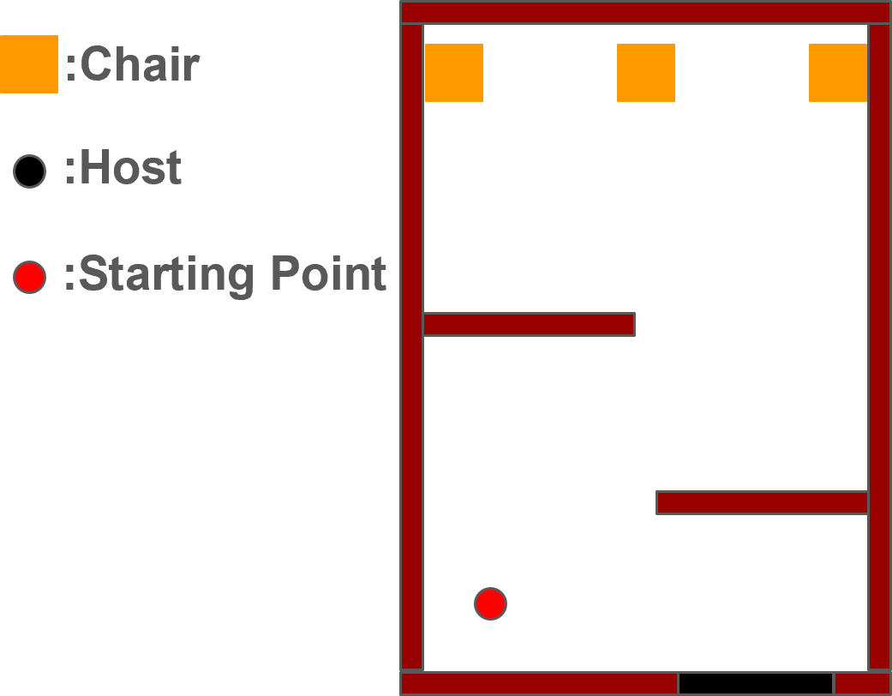
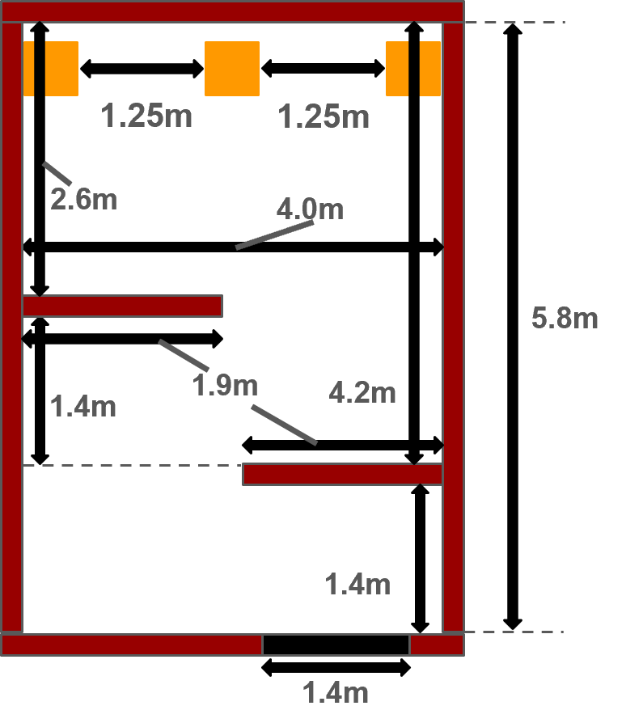

[日本語(Japanese)](./rc_jp.md) | [英語(English)](./rc_en.md)

参考元；[@Home 2022 Rules](https://athome.robocup.org/wp-content/uploads/2022_rulebook.pdf) **|** [Playground Rules 2024](/rules/EDU/rules/PlaygroundRules2024.pdf)

# Receptionistルール

## ※こちらは暫定的なルールになるため，今後変更する可能性があります

## メインゴール
このタスクでは，パーティー会場に来た2人のゲストをロボットが空席に案内する．その際，ホストへ来館したゲストについて紹介する．

 

## フォーカス
システムの統合，人とロボットのインタラクション，人物検出，人物認識

 

## セットアップ

- スタート位置
  - ロボットは来客を見つけたら、近くに寄って応対してください
- 時間
  - セットアップ時間：5分
  - 競技時間：7分
- ホスト
  - 名前は---(setup dayに公開)
  - ホストの初期位置は，上図の●印の位置とする(setup dayに公開)
- ゲスト
  - 2人のゲストにはそれぞれ名前と好きな飲み物が設定されている
  - ゲストはロボットの指示に従い、部屋の中へ案内される
  - 2人のゲストはそれぞれ別のタイミングで到着する。ただし、到着するタイミングはTCが決定するため、ロボットは部屋の中にゲストが入ってきたことを認識する必要がある
  - ただし，ゲストはTCによって入るタイミングを決められるため，部屋に入ってきたことをロボットは認識する必要がある．
  - ゲストの名前と飲み物は以下の組み合わせで決まる
    - 名前：
      - Axel
      - Chris
      - Hunter
      - Jack
      - Max
      - Paris
      - Robin
      - Olivia
      - William
    - 好きな飲み物：
      - Coke
      - Calpis
      - Green tea
      - Water
      - Tropical juice
      - Coffee
      - Soda
      - Milk
      - Wine

 

## アリーナ
# アリーナの大きさは現在未定となっており，変更の可能性があります．

今回使用する環境は上図のようにいたします．\
ドアは設置せずに競技を行う．

※しかし，@HomeやRoboCup全体からBridge Competitionに関するアリーナの要請があればそれに従うため，変更の可能性がある．

 

## 進行
##### 原則，アリーナの中にいる人間は，ロボットからの指示に従うものとする
- メインタスク（2人分繰り返す）
  - ゲストの検出
    - 部屋に入ってきたゲストを検出し，近づいたうえで挨拶する．
  - ゲストの受付
    - ロボットはゲストに名前と好きな飲み物を聞く．
    - ゲストの発話を聞き取れなかった場合、ロボットはゲストに対し、聞き返すことが可能である．
  - ホストのもとへ移動
    - ゲストを連れてホストがいる位置へ移動する．
    - 1人目の場合は事前にホストの位置を知ることができる．
  - ゲストの紹介
    - ホストに，連れているゲストの名前と好きな飲み物について紹介する．
    - 紹介中，ロボットはホストや紹介するゲストに注意を向ける．
  - ゲストを空いている席に案内
    - ゲストを空いている席へ案内し，座らせる．
    - ロボットはゲストが座れる場所（空席）を指差す．
  - 席の入れ替え
    - ゲストが座ったあと，席を移動する場合がある．
- ボーナスタスク
  - ロボットは1人目のゲストの特徴4つを2人目のゲストに紹介するとボーナス点を獲得できる．

<!-- ### タスクの流れ(動画)
<video src="./layout/RoboCup_BC_Receptionist_TaskFlow.mp4" controls="true"></video> -->

 

## ローカルルール
1. 競技時間は7分．
2. 音声認識はホスト・ゲストともに聞こえる声と距離で行う．
3. 原則，使用言語は英語とする．
4. 特徴の発話や空席の検出が採点者にとって不鮮明だと判断された場合、ログなどの提示を要求される場合がある．

    ※ログの掲示ができない場合，正しく発話していることが確認できないので点数が入らない可能性があるので注意
5. スキップについて
   - 本競技ではスキップが認められます．ただし，スキップしたタスクの得点はできなくなります．（減点はありません）
   - スキップ可能なタスクは，スコアシートに記載されています．
6. リスタートについて
   - 本競技ではリスタートが認められます．ただし，リスタートの宣言は競技開始から30秒以内かつ1回のみの宣言となります．
   - リスタート宣言後は，競技時間のストップやリセットは行われず，スコアのみリセットがされます．
7. コリジョンについて
   - 本競技におけるコリジョンは減点対象になります．ただし，コリジョンしたとしても，競技続行な場合は競技を進行します．
   - コリジョンの判定について
      - コリジョンの判定は，レフェリーが著しい接触だと判断した場合になります．（例：アリーナ内に存在する家具や壁などを移動させてしまうような衝突）
      - コリジョンが認められた場合は，減点があります．
8. 競技の強制終了について
    - 人への衝突，競技者側からの申告、競技を進行する上で著しい衝突をしたとレフェリーが判断した場合．
    - 競技者側からの申告について
      - 競技者側から，それ以上の競技続行が不可能と申告された場合，その時点で競技は終了となります．なお，コリジョン後に競技終了の申告がされた場合，コリジョンの減点がされます．

 

## 使用する特徴について

使用できる特徴リストは音声による認識を最大2つ．ゲストからの取得できる特徴を最大4つとし，計6つの中から4つの特徴を2人目のゲストに伝えることができます．特徴の詳細はTMLで決定する

- 音声認識について
  - 例：「嫌いな飲み物はなんですか？」、「アレルギーはありますか？」などパーティー会場を想定した会話ができることを想定しています．

 

## 名前と飲み物リスト
以下の中からゲストに名前と好きな飲み物がランダムに割り当てられます．

### 名前
- Axel
- Chris
- Hunter
- Jack
- Max
- Paris
- Robin
- Olivia
- William

### 飲み物
- Coke
- Calpis
- Green tea
- Water
- Tropical juice
- Coffee
- Soda
- Milk
- Wine

 

## デウスエクスマキナ

本競技では，次のデウスエクスマキナが採用されます．\
デウスエクスマキナでは減点されますが，より簡単な手法でアクションをスキップし，タスクを継続することができます．

|**アクション**|**スキップ方法**|
|------|-----|
| ゲストの人認識 | &nbsp;&bull;&nbsp;マーカーを用いてゲストが入ってきたことを認識する |
| 空席検出 | &nbsp;&bull;&nbsp;マーカーを用いて空席を検出する |

 
   
## スコアシート
このタスクでは，2回のトライアルの内，最高得点のみがスコアとして記録されます．

|**アクション**|**スコア**|
|------|-----|
| **メインタスク** |  |
| 1人目 | |
| &nbsp;&bull;&nbsp;ゲストを検出し近づく **(スキップ可能)** | 30 |
| &nbsp;&bull;&nbsp;ゲストに挨拶し名前と飲み物を正しく聞き取る | 35 |
| &nbsp;&bull;&nbsp;ホストの前に移動 | 35 |
| &nbsp;&bull;&nbsp;ホストにゲストの名前を発話 **(スキップ可能)** | 65 |
| &nbsp;&bull;&nbsp;ホストにゲストの好きな飲み物を発話 **(スキップ可能)** | 65 |
| &nbsp;&bull;&nbsp;空席の検出・案内 | 75 |
| &nbsp;&bull;&nbsp;ゲストを空席に座らせる | 50 |
| &nbsp;&bull;&nbsp;初期位置に移動 | 35 |
| 2人目 | |
| &nbsp;&bull;&nbsp;ゲストを検出し近づく **(スキップ可能)** | 30 |
| &nbsp;&bull;&nbsp;ゲストに挨拶し名前と飲み物を正しく聞き取る | 35 |
| &nbsp;&bull;&nbsp;ホストの前に移動 | 35 |
| &nbsp;&bull;&nbsp;ホストにゲストの名前を発話 **(スキップ可能)** | 65 |
| &nbsp;&bull;&nbsp;ホストにゲストの好きな飲み物を発話 **(スキップ可能)** | 65 |
| &nbsp;&bull;&nbsp;空席の検出・案内 | **90** |
| &nbsp;&bull;&nbsp;ゲストを空席に座らせる | **55** |
| &nbsp;&bull;&nbsp;初期位置に移動 | 35 |
| **ボーナスタスク** |  |
| 1人目のゲストの特徴を2人目に報告 | |
| 特徴① | 50 |
| 特徴② | 50 |
| 特徴③ | 50 |
| 特徴④ | 50 |
|  |  |
| **デウス・エクス・マキナ**† |  |
| ゲストの人認識にマーカを使う(マーカは各チーム持参) | -50 |
| 空席検出にマーカを使う(マーカは各チーム持参) | -50 |
| **ペナルティ** |  |
| 不参加（無断） | -500 |
| **減点項目** |  |
| 間違った特徴を2人目のゲストに伝える | -50×4 |
| ホストに間違った名前もしくは飲み物を伝える | -50 |
| 会話相手から視線をそらすなど、不適切な視線を継続的に示す | -50×2 |
| 人を認識できない | -70×2 |
| コリジョン | -100 |
|  |  |
| 合計（ボーナスタスクを含む） | 1000 |

 

## 運営による指示
- セットアップデイ
  - ホストの名前と初期位置を公開
- 前日のTLM
  - ホスト役について公開する
    - 事前にホストの写真などを撮りたい場合はここで撮ることができる
  - デウス・エクス・マキナを使用するチームの項目を確認
  - ホストの初期位置を再確認
- 競技開始直前（ただし，運営が決めるランダム要素をチームメンバーが知ることはできない）
  - スキップする項目の有無をチームへ最終確認する
  - ゲスト全員の位置と名前，好きな飲み物を割り当てる
  - 2人目のタスクに入ったときに，ゲストの位置の入れ替えに対する指示をする

 

## 各チームの事前準備
- 採点者について
  - 各チーム1人の採点者を出して頂きます．
  - 各チームメンバー全員がしっかりとルールを確認してきてください．

 

## 質問と回答

- 特徴は何を使ってもよいのか？
  - 事前に各チームから使用したい特徴についての申請をもらいリスト化させる．

- 特徴を5つ以上言った場合は正解しているものが優先されますか？
  - 基本的に，あらかじめ公開されている特徴リストの中から4つのみ発話してください．
  - リスト内の特徴であれば問題ないので，特徴を複数取得した後，ロボットが自律的に選択してもよいです．
    - 事前にTC/OCに伝える必要はありません．
  - もしロボットが5つ以上の特徴を発した場合，正誤に関わらず，最初に発話した4つの特徴で採点します．

- ホスト，ゲストは自チームから出すことができるか？
  - いいえ．特徴を述べる観点から，事前に知りえないゲストを公平にTC/OCが選びます．

- イスの位置は既知か？
  

  - はい．CMLとの兼ね合いもありますが，概ねこの画像の通りです．
  - ただし，@Homeから公開されるレイアウトによっては変更の可能性がある．