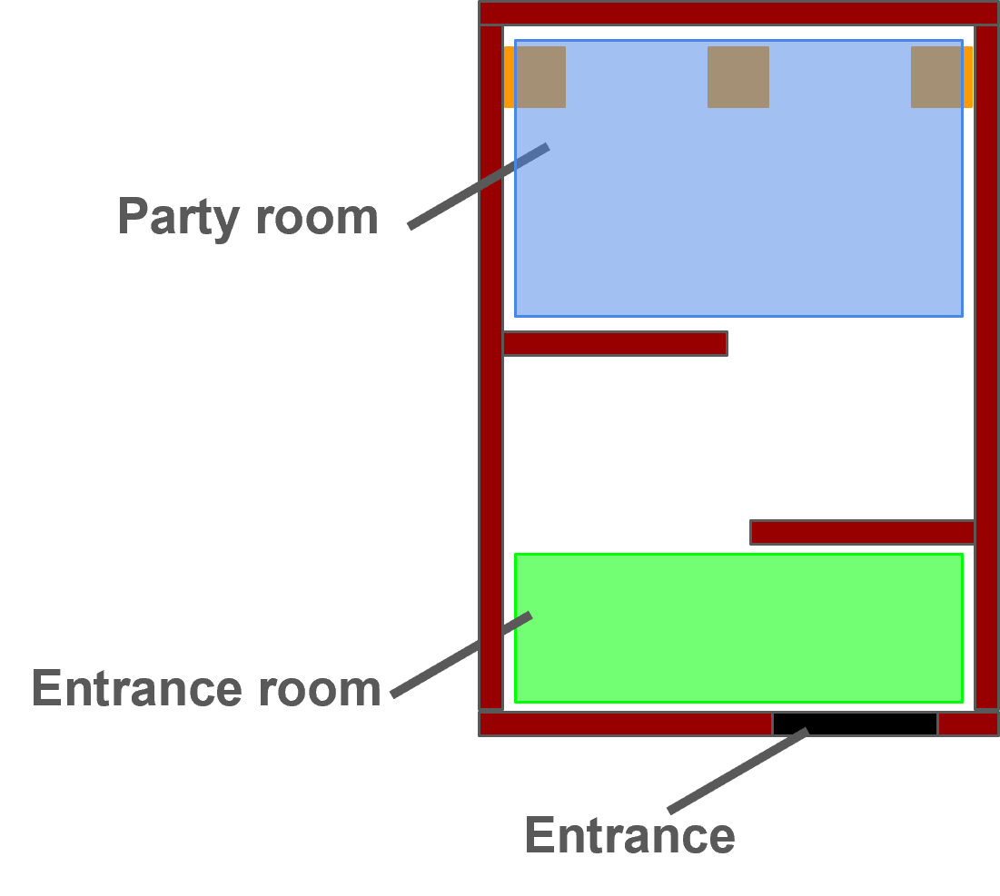

[日本語(Japanese)](./rc_jp.md) | [英語(English)](./rc_en.md)

Reference: [@Home 2022 Rules](https://athome.robocup.org/wp-content/uploads/2022_rulebook.pdf) **|** [Playground Rules 2024](/rules/EDU/rules/PlaygroundRules2024.pdf)

# Receptionist Rules

## *These are provisional rules and are subject to change in the future.

## Main Goal
In this task, the robot guides two guests who have arrived at a party venue to empty seats. During this process, the robot introduces the newly arrived guests to the host.

 

## Focus
System integration, human-robot interaction, human detection, human recognition

 

## Setup

- Start position
  - When the robot finds a guest, it should approach and interact with them.
- Time
  - Setup time: 5 minutes
  - Competition time: 7 minutes
- Host
  - Name is Chris.
  - The host's initial position is the ● mark in the figure above.
- Guests
  - Each of the two guests is assigned a name and a favorite drink.
  - Guests are guided into the room following the robot's instructions.
  - The two guests arrive at different times. However, since the Technical Committee (TC) decides the arrival timing, the robot needs to recognize when a guest has entered the room.
  - (Note: As the TC determines the entry timing, the robot must recognize that the guest has entered the room.)
  - The guest's name and drink are determined by the following combinations:
    - Name:
      - Axel
      - Chris
      - Hunter
      - Jack
      - Max
      - Paris
      - Robin
      - Olivia
      - William
    - Favorite drink:
      - Coke
      - Calpis
      - Green tea
      - Water
      - Tropical juice
      - Coffee
      - Soda
      - Milk
      - Wine

 

## Arena
# The size of the arena is currently undecided and is subject to change.

The environment to be used this time is as shown in the figure above.\
The competition will be conducted without installing a door.

*However, if there are arena requests regarding the Bridge Competition from @Home or RoboCup as a whole, we will comply with them, so it is subject to change.

 

## Procedure
#### In principle, humans inside the arena must follow the instructions from the robot.
- Main Task (Repeated for 2 people)
  - Guest Detection
    - Detect the guest who entered the room, approach them, and greet them.
  - Guest Reception
    - The robot asks the guest for their name and favorite drink.
    - If the robot cannot hear the guest's utterance, it can ask the guest to repeat it.
  - Move to the Host
    - Lead the guest and move to the position where the host is.
    - For the first guest, the robot can know the host's position in advance.
  - Guest Introduction
    - Introduce the accompanying guest's name and favorite drink to the host.
    - During the introduction, the robot pays attention to the host and the guest being introduced.
  - Guide the Guest to an Empty Seat
    - Guide the guest to an empty seat and have them sit down.
    - The robot points to a place where the guest can sit (an empty seat).
  - Seat Swapping
    - After the guest sits down, they may change seats.
- Bonus Task
  - The robot can earn bonus points by introducing four characteristics of the first guest to the second guest.

 

## Local Rules
1. The competition time is 7 minutes.
2. Voice recognition is performed at a volume and distance audible to both the host and the guest.
3. In principle, the language used is English.
4. If the utterance of characteristics or the detection of empty seats is deemed unclear to the scorer, the presentation of logs, etc., may be requested.

    *Note: If logs cannot be presented, it cannot be confirmed that the utterance was correct, which may result in no points being awarded.
5. Regarding Skips
   - Skips are allowed in this competition. However, points cannot be scored for skipped tasks. (There are no point deductions).
   - Skippable tasks are listed on the score sheet.
6. Regarding Restarts
   - Restarts are allowed in this competition. However, a restart must be declared within 30 seconds from the start of the competition, and can only be declared once.
   - After a restart is declared, the competition time will not be stopped or reset; only the score will be reset.
7. Regarding Collisions
   - Collisions in this competition are subject to point deductions. However, even if a collision occurs, the competition will proceed if it is possible to continue.
   - Regarding the judgment of a collision:
      - A collision is judged when the referee determines there is significant contact. (e.g., A collision that displaces furniture or walls within the arena).
      - If a collision is recognized, there will be a point deduction.
8. Regarding Forced Termination of the Competition
    - When the referee judges that there has been a collision with a person, a declaration from the competitor side, or a significant collision affecting the progress of the competition.
    - Regarding declarations from the competitor side:
      - If the competitor side declares that it is impossible to continue the competition further, the competition ends at that point. Furthermore, if the end of the competition is declared after a collision, the point deduction for the collision will be applied.

 

## Regarding the Features to be Used

The list of features can include up to two voice recognition and up to four features obtained from the guest, for a four of the total six features that can be conveyed to the second guest.

- Regarding Voice Recognition
  - Example: It is expected that the robot can engage in conversations suitable for a party venue, such as "What drinks do you dislike?" or "Do you have any allergies?".

 

## Name and Drink List
Names and favorite drinks will be randomly assigned to guests from the following:

### Names
- Axel
- Chris
- Hunter
- Jack
- Max
- Paris
- Robin
- Olivia
- William

### Drinks
- Coke
- Calpis
- Green tea
- Water
- Tropical juice
- Coffee
- Soda
- Milk
- Wine

 

## Deus Ex Machina

The following Deus Ex Machina are adopted in this competition.\
While points are deducted when using Deus Ex Machina, it allows you to skip actions using simpler methods and continue the task.

|**Action**|**Skip Method**|
|------|-----|
| Guest human recognition | &nbsp;&bull;&nbsp;Use a marker to recognize that a guest has entered |
| Empty seat detection | &nbsp;&bull;&nbsp;Use a marker to detect an empty seat |

 
   
## Score Sheet
In this task, only the highest score out of the 2 trials will be recorded as the score.

|**Action**|**Score**|
|------|-----|
| **Main Task** |  |
| 1st Person | |
| &nbsp;&bull;&nbsp;Detect and approach the guest **(Skippable)** | 30 |
| &nbsp;&bull;&nbsp;Greet the guest and correctly hear their name and drink | 35 |
| &nbsp;&bull;&nbsp;Move in front of the host | 35 |
| &nbsp;&bull;&nbsp;Speak the guest's name to the host **(Skippable)** | 65 |
| &nbsp;&bull;&nbsp;Speak the guest's favorite drink to the host **(Skippable)** | 65 |
| &nbsp;&bull;&nbsp;Detect and guide to an empty seat | 75 |
| &nbsp;&bull;&nbsp;Have the guest sit in the empty seat | 50 |
| &nbsp;&bull;&nbsp;Move to the initial position | 35 |
| 2nd Person | |
| &nbsp;&bull;&nbsp;Detect and approach the guest **(Skippable)** | 30 |
| &nbsp;&bull;&nbsp;Greet the guest and correctly hear their name and drink | 35 |
| &nbsp;&bull;&nbsp;Move in front of the host | 35 |
| &nbsp;&bull;&nbsp;Speak the guest's name to the host **(Skippable)** | 65 |
| &nbsp;&bull;&nbsp;Speak the guest's favorite drink to the host **(Skippable)** | 65 |
| &nbsp;&bull;&nbsp;Detect and guide to an empty seat | **90** |
| &nbsp;&bull;&nbsp;Have the guest sit in the empty seat | **55** |
| &nbsp;&bull;&nbsp;Move to the initial position | 35 |
| **Bonus Task** |  |
| Report the characteristics of the 1st guest to the 2nd guest | |
| Feature 1 | 50 |
| Feature 2 | 50 |
| Feature 3 | 50 |
| Feature 4 | 50 |
|  |  |
| **Deus Ex Machina**† |  |
| Use a marker for guest human recognition (marker brought by each team) | -50 |
| Use a marker for empty seat detection (marker brought by each team) | -50 |
| **Penalty** |  |
| Non-participation (unauthorized) | -500 |
| **Deduction Items** |  |
| Convey wrong characteristics to the 2nd guest | -50×4 |
| Convey wrong name or drink to the host | -50 |
| Continuously showing inappropriate gaze, such as looking away from the conversation partner | -50×2 |
| Cannot recognize a person | -70×2 |
| Collision | -100 |
|  |  |
| Total (including bonus tasks) | 1000 |

 

## Instructions from Operations
- Setup Day
  - Reveal the host's name and initial position
- TLM on the Previous Day
  - Reveal information about the host role
    - If you want to take pictures of the host in advance, you can do so here
  - Check the items for teams using Deus Ex Machina
  - Reconfirm the host's initial position
- Immediately Before the Competition Starts (However, team members cannot know the random elements decided by the operations)
  - Final confirmation with the team on whether there are any items to be skipped
  - Assign the positions, names, and favorite drinks of all guests
  - Give instructions regarding the swapping of guest positions when entering the second person's task

 

## Advance Preparation for Each Team
- Regarding Scorers
  - Each team is requested to provide one scorer.
  - All team members must thoroughly check the rules beforehand.

 

## Questions and Answers (Q&A)

- Can any feature be used?
  - We will receive applications from each team in advance regarding the features they want to use and compile them into a list.

- If robot list more than five features, will the ones that are correct take priority?
  - Basically, please only state 4 features from the pre-published feature list.
  - As long as they are features within the list, there is no problem, so the robot may autonomously select them after acquiring multiple features.
    - There is no need to inform the TC/OC in advance.
  - If the robot states 5 or more features, regardless of whether they are correct or incorrect, the first 4 stated features will be scored.

- Can the host and guests be provided from our own team?
  - No. From the perspective of stating characteristics, the TC/OC will fairly select guests who cannot be known in advance.

- Is the position of the chairs known?
  

  - Yes. There is also a balance with the CML, but it is generally as shown in this image.
  - However, it is subject to change depending on the layout published by @Home.